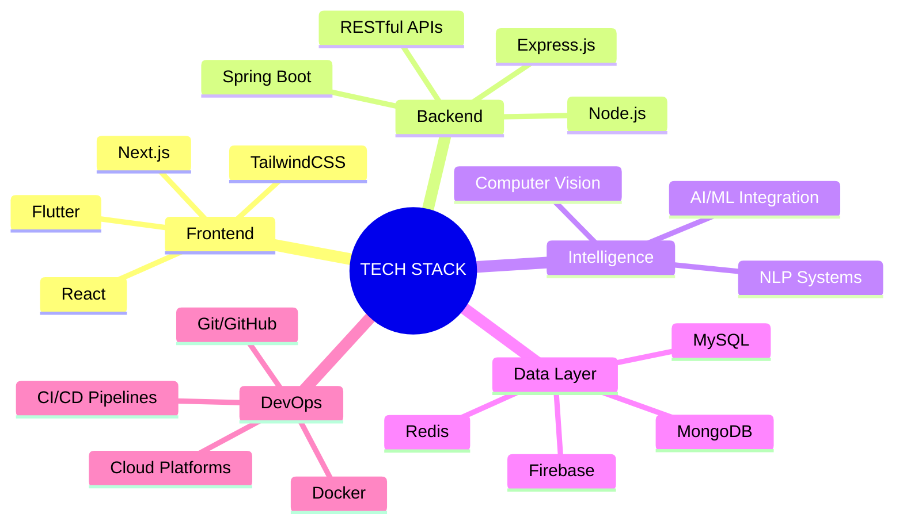

<div align="center">

# 🌌 DAVID ONYANGO

```ascii
╔══════════════════════════════════════════════════════════════╗
║  FULL-STACK ARCHITECT • AI ENGINEER • DIGITAL INNOVATOR     ║
╚══════════════════════════════════════════════════════════════╝
```


[](/)
[](https://linkedin.com/in/daudislugger)
[](mailto:davidonya2@gmail.com)
[](https://github.com/DavidOnyango)

</div>

---

## 🧬 CORE.IDENTITY

```javascript
const david = {
  role: "Full-Stack Architect & AI Integration Specialist",
  mission: "Engineering scalable solutions that bridge technology and humanity",
  philosophy: "Clean code. Maximum impact. Zero compromise.",
  status: "Building tomorrow's digital infrastructure today"
};
```

I architect **next-generation applications** that don't just solve problems—they **redefine possibilities**. From intelligent AI systems to enterprise-grade platforms, I transform complex challenges into elegant, scalable solutions that drive real-world impact.

---

## ⚡ TECH.ARSENAL

<div align="center">

### 🎯 PRIMARY WEAPONS



</div>

| Domain | Technologies | Mastery Level |
|--------|-------------|---------------|
| **⚛️ Frontend Engineering** | React • Flutter • Next.js • HTML5 • CSS3 • JavaScript ES6+ | ████████░░ 80% |
| **🔧 Backend Architecture** | Node.js • Express • Java • Spring Boot • RESTful APIs | ████████░░ 85% |
| **🤖 AI & Intelligence** | Machine Learning • Computer Vision • NLP • TensorFlow | ███████░░░ 70% |
| **💾 Database Systems** | MySQL • MongoDB • PostgreSQL • Firebase Realtime DB | ████████░░ 80% |
| **☁️ Cloud & DevOps** | AWS • Docker • Git • CI/CD • Serverless Architectures | ███████░░░ 75% |

---

## 🚀 MISSION.CRITICAL_PROJECTS

<div align="center">

### 🏆 FLAGSHIP DEPLOYMENTS

</div>

<details open>
<summary><b>🩸 BLOOD CONNECT SYSTEM</b> — Lifesaving Technology Platform</summary>

```yaml
Status: Production Ready
Impact: Healthcare Infrastructure
Tech: Next.js • Node.js • MySQL • Real-time Matching
Mission: Connecting blood donors with hospitals in critical moments
```

**Revolutionary Features:**
- ⚡ Real-time donor-hospital matching algorithm
- 📍 Geolocation-based emergency response system
- 🔐 HIPAA-compliant security architecture
- 📊 Predictive analytics for blood supply management

[🔗 View Repository](https://github.com/Daudicode12/blood-donation-with-next.js.git) | [📺 Live Demo](#)

</details>

<details>
<summary><b>🤖 CROPCARE AI</b> — Agricultural Intelligence System</summary>

```yaml
Status: Active Development
Impact: AgriTech Revolution
Tech: Flutter • TensorFlow • Computer Vision • Firebase
Mission: Empowering farmers with AI-driven crop health diagnostics
```

**AI Capabilities:**
- 🔬 Real-time disease detection using computer vision
- 🐛 Pest identification with 95%+ accuracy
- 💊 Instant treatment recommendations
- 📈 Crop health analytics & predictive insights

[🔗 View Repository](https://github.com/Daudicode12/plant-care.git) | [📱 Try Beta](#)

</details>

<details>
<summary><b>🌾 AGRI CONNECT</b> — Farmer-Market Integration Platform</summary>

```yaml
Status: Scaling Phase
Impact: Agricultural Economics
Tech: React • Node.js • Express • MongoDB
Mission: Direct market access for farmers through digital transformation
```

**Platform Features:**
- 💰 Transparent pricing & market analytics
- 🤝 Direct farmer-buyer connections
- 📦 Supply chain optimization
- 📊 Real-time commodity tracking

[🔗 Coming Soon](#)

</details>

<details>
<summary><b>💬 QUANTUM CHATBOT AI</b> — Intelligent Conversation Engine</summary>

```yaml
Status: Beta Release
Impact: Customer Experience Enhancement
Tech: Node.js • NLP • Machine Learning • WebSocket
Mission: Next-gen conversational AI for seamless user interactions
```

**Intelligence Features:**
- 🧠 Context-aware conversation handling
- 🌐 Multi-language support
- 📚 Dynamic knowledge base integration
- ⚡ Real-time response optimization

[🔗 Explore](#)

</details>

---

## 📡 ACTIVE.RESEARCH

<div align="center">

```
┌─────────────────────────────────────────────────────────┐
│  CURRENT EXPLORATION VECTORS                            │
├─────────────────────────────────────────────────────────┤
│  → Advanced AI/ML model integration & optimization     │
│  → Microservices architecture & distributed systems    │
│  → Serverless computing & edge deployment strategies   │
│  → WebAssembly for high-performance web applications   │
│  → Blockchain integration for decentralized solutions  │
│  → Quantum computing readiness & algorithms            │
└─────────────────────────────────────────────────────────┘
```

</div>

---

## 📊 SYSTEM.METRICS

<div align="center">


### 🏆 ACHIEVEMENT UNLOCKED

[](https://github.com/DavidOnyango)

</div>

---

## 🌐 CONNECT.PROTOCOL

<div align="center">

```ascii
┏━━━━━━━━━━━━━━━━━━━━━━━━━━━━━━━━━━━━━━━━━━━━━━━━━━━━┓
┃  OPEN FOR COLLABORATION • INNOVATION • IMPACT      ┃
┗━━━━━━━━━━━━━━━━━━━━━━━━━━━━━━━━━━━━━━━━━━━━━━━━━━━━┛
```

**Let's build something extraordinary together.**

📧 **Secure Channel:** [davidonya2@gmail.com](mailto:davidonya2@gmail.com)  
💼 **Professional Network:** [LinkedIn/DavidOnyango](https://linkedin.com/in/daudislugger)  
🌐 **Digital Presence:** Portfolio Launching Soon  
🐙 **Open Source:** [GitHub/DavidOnyango](https://github.com/Daudicode12)


</div>

---

<div align="center">

**⚡ "Code is poetry written in logic, and innovation is the verse that changes the world." ⚡**

*Engineered with precision by [David Onyango](https://github.com/Daudicode12) • © 2025*

</div>
