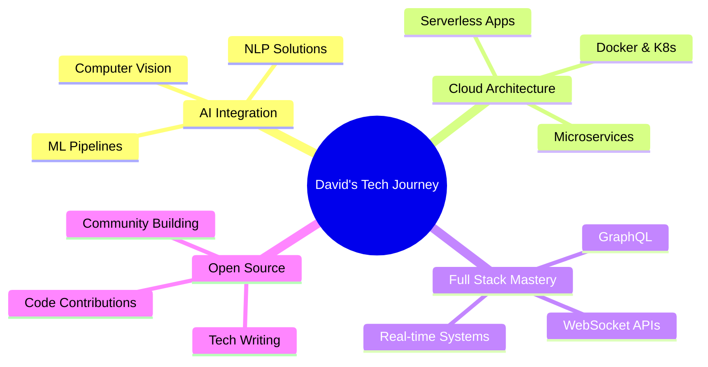

<div align="center">

<!-- Animated Banner -->


<!-- Animated Typing Text -->
<a href="https://git.io/typing-svg"></a>

<!-- Stunning Profile Badges -->
<p align="center">
  
  
  
</p>

<!-- Cool Divider -->


</div>

## 🎯 ABOUT ME


```typescript
const david = {
  pronouns: "He" | "Him",
  location: "🌍 Nairobi, Kenya",
  role: "Full Stack Architect & AI Engineer",
  
  workingOn: {
    primary: "Building AI-powered healthcare solutions",
    secondary: "Contributing to open source",
    learning: "Cloud Native Architecture & Serverless"
  },
  
  technologies: {
    frontend: ["React", "Next.js", "Flutter", "Tailwind CSS"],
    backend: ["Node.js", "Express", "Spring Boot", "Firebase"],
    databases: ["MongoDB", "MySQL", "Redis", "Firestore"],
    ai_ml: ["TensorFlow", "Computer Vision", "NLP"],
    devops: ["Docker", "Git", "Postman", "Figma"],
    cloud: ["Firebase", "Vercel", "AWS (learning)"]
  },
  
  currentChallenge: "Building scalable real-time systems 🚀",
  funFact: "I debug with console.log and I'm proud! 😄"
};
```

<br clear="right"/>

---

## 🛠️ TECH STACK & TOOLS

<div align="center">

### 💻 Frontend Development
<p>
  
  
  
  
  
  
  
</p>

### ⚙️ Backend Development
<p>
  
  
  
  
  
</p>

### 🗄️ Databases & Cloud
<p>
  
  
  
  
</p>

### 🤖 AI & Machine Learning
<p>
  
  
  
</p>

### 🔧 Tools & Platforms
<p>
  
  
  
  
  
  
</p>

</div>


## 🚀 FEATURED PROJECTS

<div align="center">

<table>
<tr>
<td width="50%" valign="top">

### 🩸 Blood Connect System
[](https://github.com/Daudicode12/blood-donation-with-next.js.git)


**Revolutionizing blood donation** with real-time donor-hospital connections. Features geolocation-based matching, emergency alerts, and analytics dashboards.

✨ **Key Features:**
- ⚡ Sub-5s response time
- 🎯 AI-powered matching
- 📍 Real-time geolocation
- 🔔 Push notifications

</td>
<td width="50%" valign="top">

### 🌾 CropCare AI
[](https://github.com/Daudicode12/plant-care.git)


**AI-powered crop disease detection** helping farmers identify and treat plant diseases instantly with computer vision.

✨ **Key Features:**
- 📸 95%+ accuracy detection
- 🤖 Deep learning models
- 💊 Treatment recommendations
- 📱 Offline-first design

</td>
</tr>

<tr>
<td width="50%" valign="top">

### 🌾 Agri Connect
[](#)


**Connecting farmers directly to markets**, eliminating middlemen and maximizing profits through smart contracts and real-time pricing.

✨ **Key Features:**
- 💹 Real-time pricing algorithms
- 🤝 Smart contract integration
- 📦 Supply chain tracking
- 🌐 Multi-language support

</td>
<td width="50%" valign="top">

### 💬 Nexus AI Chatbot
[](#)


**Next-generation conversational AI** with context-aware responses and multi-modal learning for seamless interactions.

✨ **Key Features:**
- 🧠 Contextual memory
- 🎯 98% intent accuracy
- 🌐 Multi-platform deployment
- 🔒 Privacy-first design

</td>
</tr>
</table>

</div>


## 📊 GITHUB ANALYTICS

<div align="center">
  


<!-- Activity Graph -->


<!-- Trophy Stats -->


</div>


## 🌱 CURRENT FOCUS

<div align="center">



</div>

<div align="center">

### 📚 Currently Learning

<table>
  <tr>
    <td align="center" width="25%">
      
      <br>AWS Cloud
    </td>
    <td align="center" width="25%">
      
      <br>Kubernetes
    </td>
    <td align="center" width="25%">
      
      <br>GraphQL
    </td>
    <td align="center" width="25%">
      
      <br>Rust
    </td>
  </tr>
</table>

</div>


## 🤝 LET'S CONNECT

<div align="center">

<a href="mailto:davidonnya2@gmail.com">
  
</a>
<a href="https://linkedin.com/in/daudislugger">
  
</a>
<a href="https://github.com/Daudicode12">
  
</a>
<a href="#">
  
</a>

<br><br>

### 💬 Let's Build Something Amazing Together!

<p>
I'm always open to collaborating on innovative projects, especially in:<br>
🩺 <b>Healthcare Tech</b> • 🌾 <b>AgriTech</b> • 🤖 <b>AI Solutions</b> • 🌍 <b>Social Impact</b>
</p>

<br>

<!-- Visitor Counter -->


<!-- GitHub Stats Badges -->
<br><br>


</div>


<div align="center">

### ⚡ Fun Fact

```javascript
const coffeeConsumed = Infinity;
const bugsFixed = coffeeConsumed * 2;
const sleepingHours = 24 - codingHours; // Usually close to 0
```

---

### 🎯 2025 Goals

✅ Contribute to 50+ open source projects  
✅ Build 10 production-ready AI applications  
✅ Mentor 100+ aspiring developers  
✅ Master cloud-native architecture  

---


---

**💙 Thanks for visiting! Let's innovate together.**


</div>
